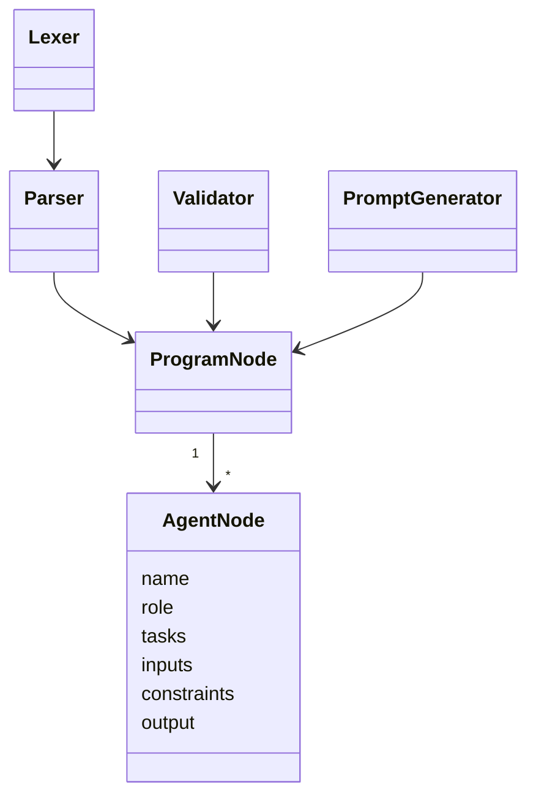

# Prompt DSL Architecture — Article Summarization

## Overview

This project implements a text-to-prompt compiler using a domain-specific language (DSL) focused on article summarization tasks.

## Architecture (UML - simplified)



## Pipeline Flow

```
DSL Text File
    ↓
Lexer (tokenization)
    ↓
Parser (AST construction)
    ↓
Validator (semantic checks)
    ↓
PromptGenerator (text output)
    ↓
AI Prompt
```

## Use Case: Article Summarization

The current implementation is tailored for summarization workflows:

1. **Input**: A DSL file defining a summarization agent and constraints
2. **Example DSL**:
   ```dsl
   AGENT ArticleSummarizer
   ROLE Summarizer
   TASK Summarize the article in article.txt
   INPUT article.txt
   CONSTRAINT Brief
   OUTPUT TEXT
   ```
3. **Output**: A structured prompt that instructs an AI to summarize text

## Design Principles

- **Separation of Concerns**: Lexer → Parser → Validator → Generator are independent stages
- **AST as Intermediate Representation**: Decouples parsing from code generation
- **Semantic Validation**: Enforces DSL constraints before prompt generation
- **Consistent Output**: Same DSL always generates the same prompt
