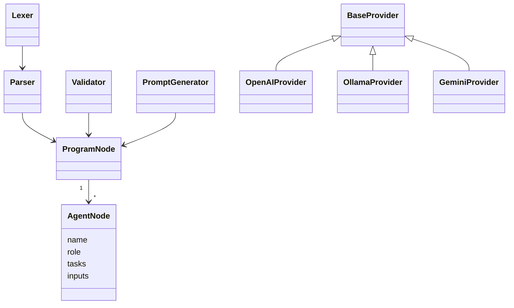

## Architecture (UML - simplified)

```mermaid
classDiagram
    ProgramNode "1" --> "*" AgentNode
    AgentNode : name
    AgentNode : role
    AgentNode : tasks
    AgentNode : inputs
    Parser --> ProgramNode
    Lexer --> Parser
    Validator --> ProgramNode
    PromptGenerator --> ProgramNode
    BaseProvider <|-- OpenAIProvider
    BaseProvider <|-- OllamaProvider
    BaseProvider <|-- GeminiProvider
```
